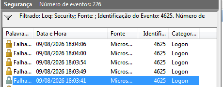
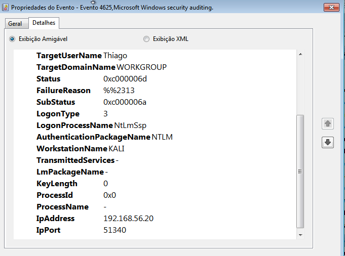
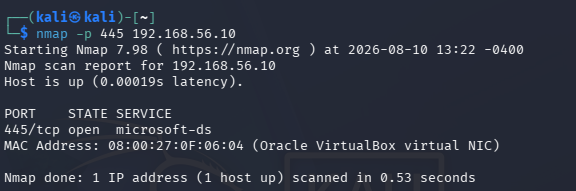
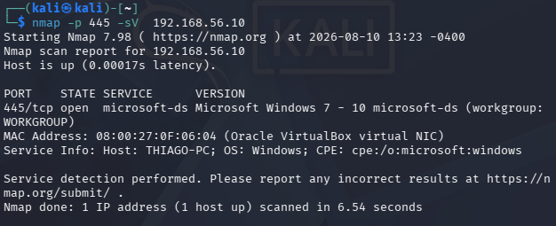
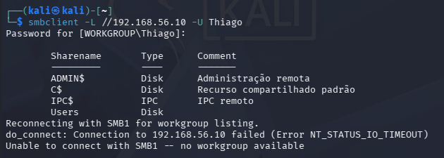
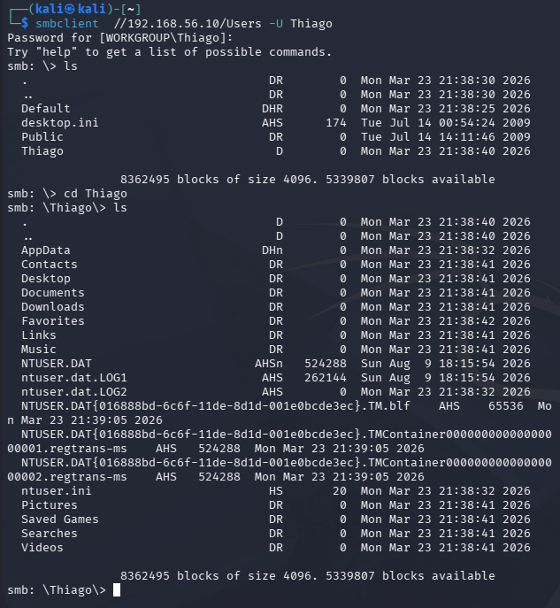
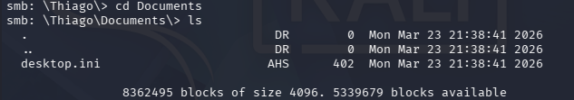

# Análise de Evento 4624 - Logon Bem-Sucedido

## O que aconteceu

Durante os testes no laboratório, foram realizadas tentativas de autenticação SMB a partir da máquina Kali Linux contra o Windows 7.

As primeiras tentativas utilizaram credenciais incorretas e geraram eventos 4625. Depois de utilizar a senha correta, foi registrado um evento 4624, indicando que a autenticação foi realizada com sucesso.

## Dados observados

- Event ID: 4624
- Usuário: Thiago
- Logon Type: 3
- Authentication Package: NTLM
- Workstation: KALI
- IP de origem: 192.168.56.20
- Porta de origem: 60410
- NTLM: NTLM V2

## Relação entre os eventos

A sequência observada foi:

18:35:59 - 4625

18:36:06 - 4625

18:36:11 - 4625

18:36:15 - 4625

18:36:19 - 4625

18:36:29 - 4624

As falhas ocorreram antes do logon bem-sucedido. Como o teste foi realizado no laboratório, foi possível confirmar que o último acesso utilizou as credenciais corretas.

## Análise

O Event ID 4624 confirma que uma autenticação foi aceita pelo Windows.

O Logon Type 3 indica que o acesso ocorreu através da rede. O evento também registra a máquina KALI e o endereço IP 192.168.56.20 como origem.

A sequência de eventos mostra que várias tentativas com credenciais incorretas ocorreram antes do acesso ser aceito.

Em um ambiente real, uma sequência semelhante poderia justificar uma investigação para verificar se as tentativas fazem parte de uma tentativa de adivinhação de credenciais.

## Verificação do serviço SMB

Após confirmar a autenticação, foi verificado se o serviço SMB estava acessível no Windows.

Foi utilizado:

nmap -p 445 192.168.56.10

O parâmetro `-p 445` faz o Nmap verificar especificamente a porta TCP 445, normalmente utilizada pelo SMB.

O resultado mostrou a porta 445 como aberta.

Em seguida, foi realizada uma identificação do serviço:

nmap -p 445 -sV 192.168.56.10

O parâmetro `-sV` faz o Nmap tentar identificar o serviço e sua versão.

Nesse teste, a porta foi identificada como `microsoft-ds`, indicando o serviço SMB utilizado pelo Windows.

## Acesso aos compartilhamentos

Com o serviço identificado, foi utilizado o `smbclient` para verificar os compartilhamentos disponíveis:

smbclient -L //192.168.56.10 -U Thiago

O parâmetro `-L` solicita a listagem dos compartilhamentos disponíveis no servidor SMB.

Foram identificados compartilhamentos como `ADMIN$`, `C$`, `IPC$` e `Users`.

Depois, foi realizado o acesso ao compartilhamento `Users`:

smbclient //192.168.56.10/Users -U Thiago

Após a autenticação, foi possível listar os diretórios disponíveis e acessar o diretório `Thiago`.

## Navegação no compartilhamento

Dentro do diretório do usuário, foram listadas as pastas disponíveis.

Em seguida, foi acessada a pasta `Documents`:

cd Documents

E o conteúdo foi verificado com:

ls

A pasta continha apenas o arquivo `desktop.ini` no momento do teste.

## Evidências

### Evidência 01 - Sequência de autenticações

A imagem mostra várias falhas 4625 seguidas por um evento 4624.

### Evidência 02 - Detalhes do logon

O evento mostra o usuário, o tipo de logon, o protocolo de autenticação, a máquina de origem e o endereço IP.

### Evidência 03 - Porta 445

Mostra a porta TCP 445 aberta no Windows 7.

### Evidência 04 - Identificação do SMB

Mostra a identificação do serviço SMB realizada pelo Nmap através do parâmetro `-sV`.

### Evidência 05 - Compartilhamentos SMB

Mostra os compartilhamentos disponíveis no Windows, incluindo `Users`.

### Evidência 06 - Diretório do usuário

Mostra o acesso ao compartilhamento `Users` e a navegação até o diretório `Thiago`.

### Evidência 07 - Diretório Documents

Mostra o acesso à pasta `Documents` e a listagem do conteúdo encontrado.

## Resultado

A investigação confirmou uma autenticação bem-sucedida após várias tentativas malsucedidas.

Depois da autenticação, foi possível identificar o serviço SMB, listar os compartilhamentos disponíveis e acessar o diretório do usuário `Thiago`.

O acesso à pasta `Documents` também foi realizado, mas não foram encontrados arquivos relevantes além do `desktop.ini`.

Todo o procedimento foi realizado em ambiente de laboratório controlado.
