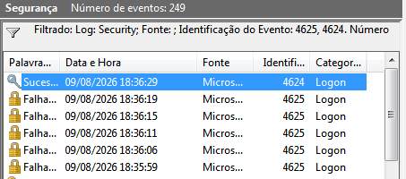
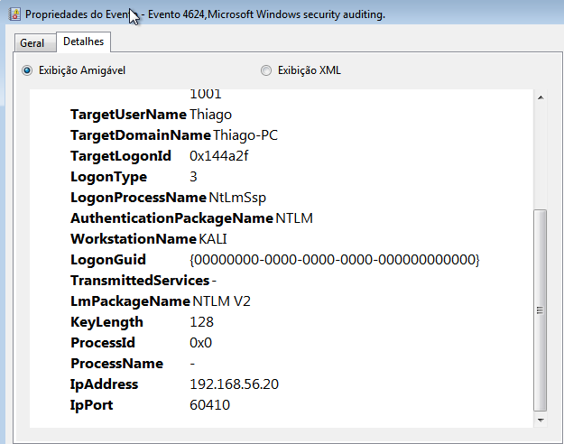

# Análise de Evento 4624 - Logon Bem-Sucedido

## O que aconteceu

Durante os testes no laboratório, foram realizadas algumas tentativas de autenticação SMB a partir da máquina Kali Linux contra o Windows 7.

As primeiras tentativas utilizaram credenciais incorretas e geraram eventos 4625, indicando falha na autenticação.

Depois de utilizar a senha correta, foi registrado um evento 4624, indicando que a autenticação foi realizada com sucesso.

## Dados observados

- Event ID: 4624
- Usuário: Thiago
- Logon Type: 3
- Authentication Package: NTLM
- Workstation: KALI
- IP de origem: 192.168.56.20
- Porta de origem: 60410
- NTLM: NTLM V2

## Relação entre os eventos

Os registros mostram uma sequência de falhas de autenticação seguida por uma autenticação bem-sucedida.

A sequência observada foi:

18:35:59 - 4625
18:36:06 - 4625
18:36:11 - 4625
18:36:15 - 4625
18:36:19 - 4625
18:36:29 - 4624

Isso permite relacionar as tentativas realizadas no Kali Linux com os eventos registrados no Windows.

## Análise

O Event ID 4624 confirma que uma autenticação foi aceita pelo Windows.

O Logon Type 3 indica que o acesso ocorreu através da rede. O evento também registra a máquina KALI e o endereço IP 192.168.56.20 como origem.

A sequência de eventos é relevante porque mostra que várias tentativas com credenciais incorretas ocorreram antes do acesso ser bem-sucedido.

Neste laboratório, sabemos que o sucesso ocorreu porque a senha correta foi utilizada posteriormente. Em um ambiente real, uma sequência semelhante poderia justificar uma investigação mais aprofundada para verificar se houve tentativa de adivinhação de credenciais.

## Evidências

### Evidência 01 - Sequência de autenticações

A imagem mostra várias falhas 4625 seguidas por um evento 4624.

### Evidência 02 - Detalhes do logon

O evento mostra o usuário, o tipo de logon, o protocolo de autenticação, a máquina de origem e o endereço IP.

## Resultado

A investigação confirmou que houve uma autenticação bem-sucedida após várias tentativas malsucedidas.

Como o cenário foi realizado de forma controlada no laboratório, foi possível determinar que o acesso bem-sucedido ocorreu após a utilização das credenciais corretas.
