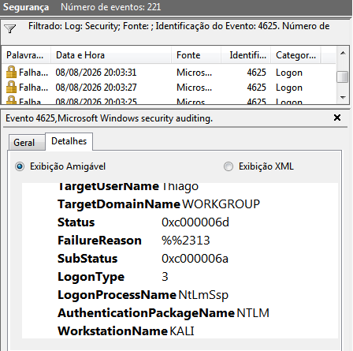
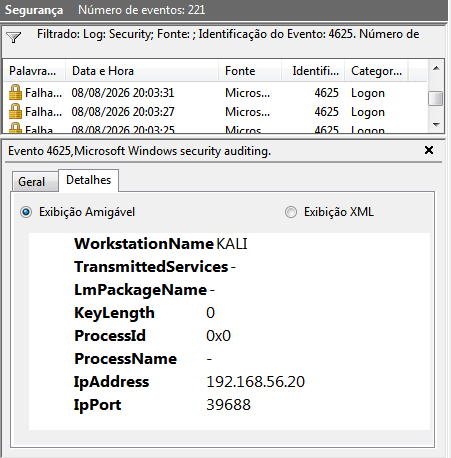

# Análise de Evento 4625 - Falha de Autenticação

## Objetivo

Investigar falhas de autenticação registradas no Windows e identificar de onde partiram as tentativas de acesso.

## Ambiente

- Sistema analisado: Windows 7
- Máquina utilizada nos testes: Kali Linux
- Rede: 192.168.56.0/24
- IP do Windows: 192.168.56.10
- IP do Kali: 192.168.56.20

## Evento identificado

- Event ID: 4625
- Tipo: Falha de autenticação
- Usuário alvo: Thiago
- Logon Type: 3
- Authentication Package: NTLM
- Workstation: KALI
- IP de origem: 192.168.56.20

## Análise

O Event ID 4625 é registrado quando uma tentativa de autenticação falha.

Durante os testes, as tentativas partiram da máquina Kali Linux, utilizando o endereço IP 192.168.56.20.

O Logon Type 3 indica que a tentativa de logon ocorreu através da rede.

O evento também mostra o uso do NTLM como pacote de autenticação.

Foram identificadas várias falhas de autenticação durante os testes realizados no laboratório.

## Evidências

### Evidência 01 - Detalhes do evento

### Evidência 02 - Origem da tentativa

## Resultado

Os eventos analisados mostram tentativas de autenticação malsucedidas originadas da máquina Kali Linux contra o Windows 7.

Até este ponto, as evidências confirmam falhas de autenticação, mas ainda não permitem afirmar que houve um ataque de força bruta.

## O que poderia ser feito

- Acompanhar a quantidade de eventos 4625 em um determinado período.
- Comparar os horários das falhas e o IP de origem.
- Verificar se várias tentativas estão sendo direcionadas ao mesmo usuário.
- Criar alertas para um número elevado de falhas consecutivas.
- Avaliar políticas de bloqueio de conta.
